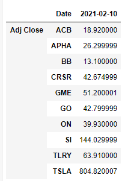

# Wallstreetbets analyisis with webscraping, NLP and SQL

Notes: 

pushshift.io API for fetching WSB data

Conda install psaw

psycopg2

https://www.youtube.com/watch?v=wpCoHEieOxw&ab_channel=CodingFlamingo

for ref https://www.youtube.com/watch?v=CJAdCLZaISw&ab_channel=PartTimeLarry

Use a stock tick list to compare output

Using pushift to get an understanding on what is being talked about in terms of stock tickers on the forum daily
Get a hold of a NYSE + NASDAQ stock ticker api or downloadable file
