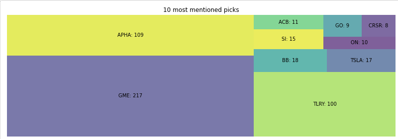
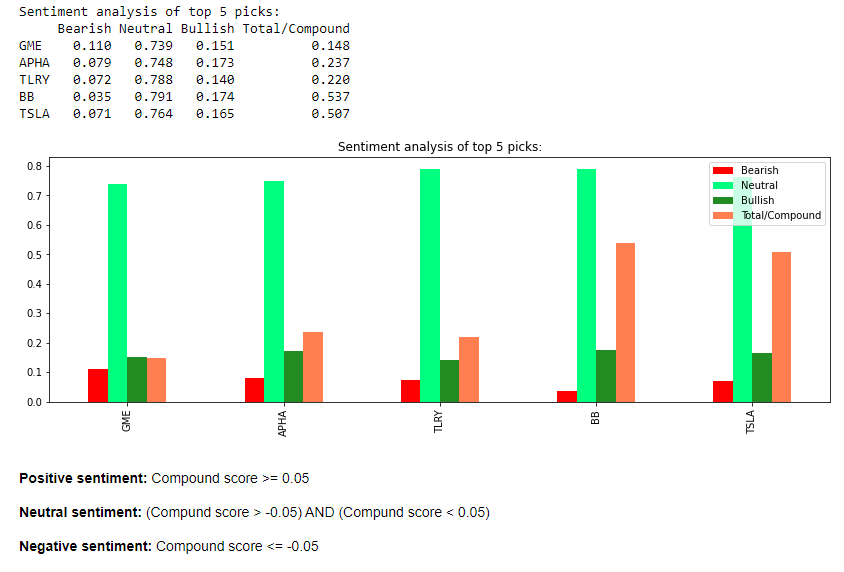

# Understanding Reddit investing communities('Wallstreetbets', 'stocks, 'investing' and 'stockmarket') with webscraping, yfinance and NLP.
The power of social media has recently drawn alot of attention in the media and investment world. Some of the most popular finance/investment subreddits such as 'wallstreetbets', 'stocks', 'investing' and 'stockmarket' accumulate upwards of 15 million users. Understanding what's going on in this world is almost impossible as an outside investor, BUT with some automation every outsider has a chance.

This program can be used to scrape and analyse any investing/stock related subreddits, to gain a basic understanding on whats being discussed on a daily basis. (i.e /wallstreetbets, /investing, /stocks).
The application uses Vader SentimentIntensityAnalyzer to calculate ticker compound values with the incorporation of custom reddit "slang" words related to stocks and investing.
The script furthermore takes the most discussed tickers and look up their current price using the yfinance API.

**Example output**

